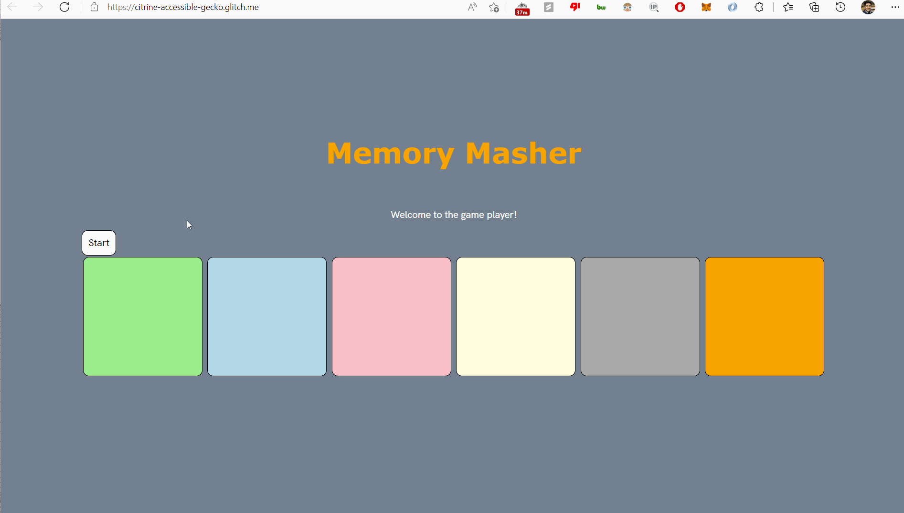

# Pre-work - *Memory Game*

**Memory Masher** is a Light & Sound Memory game to apply for CodePath's SITE Program. 

Submitted by: **Samarth Tehri**

Time spent: **1** hours spent in total

Link to project: https://glitch.com/edit/#!/citrine-accessible-gecko?path=index.html%3A1%3A0
Link to live prototype: https://citrine-accessible-gecko.glitch.me/

## Required Functionality

The following **required** functionality is complete:

* [x] Game interface has a heading (h1 tag), a line of body text (p tag), and four buttons that match the demo app
* [x] "Start" button toggles between "Start" and "Stop" when clicked. 
* [x] Game buttons each light up and play a sound when clicked. 
* [x] Computer plays back sequence of clues including sound and visual cue for each button
* [x] Play progresses to the next turn (the user gets the next step in the pattern) after a correct guess. 
* [x] User wins the game after guessing a complete pattern
* [x] User loses the game after an incorrect guess

The following **optional** features are implemented:

* [x] Any HTML page elements (including game buttons) has been styled differently than in the tutorial
* [x] Buttons use a pitch (frequency) other than the ones in the tutorial
* [x] More than 4 functional game buttons
* [x] Playback speeds up on each turn
* [x] Computer picks a different pattern each time the game is played
* [x] Player only loses after 3 mistakes (instead of on the first mistake)
* [ ] Game button appearance change goes beyond color (e.g. add an image)
* [ ] Game button sound is more complex than a single tone (e.g. an audio file, a chord, a sequence of multiple tones)
* [ ] User has a limited amount of time to enter their guess on each turn

The following **additional** features are implemented:

- [x] Saved previous code as comment, for quick development purpose in future
- [x] Added comments to enhance readability

## Video Walkthrough (GIF)

Note: No sounds plays through a gif file. Audio functionality works perfectly in live demo link below.

## Live Demo

Link to live prototype: https://citrine-accessible-gecko.glitch.me/

## Reflection Questions
1. If you used any outside resources to help complete your submission (websites, books, people, etc) list them here. 
None

2. What was a challenge you encountered in creating this submission (be specific)? How did you overcome it? (recommended 200 - 400 words) 

3. What questions about web development do you have after completing your submission? (recommended 100 - 300 words) 

4. If you had a few more hours to work on this project, what would you spend them doing (for example: refactoring certain functions, adding additional features, etc). Be specific. (recommended 100 - 300 words) 
If i had a few extra hours to work on this project, I would spend them in creating custom animations to each buttons, implementing funny but memorable audio to those buttons, and add a 'shuffle' mode, where it will shuffle up the button colors, and their audios, and animations - such that it feels like a new game, a new challenge! And a 'wild' mode button, that would change the button placement order and size of each button randomly: truly a dangerous challenge. The optional features were a good addition to the original, therefore doing something similar in that region would be cool too. Apart from feature additions, I would refactor the code style, such that the code is well documented and therefore reduce debugging time.

## Interview Recording URL Link

[My 5-minute Interview Recording](your-link-here)

## License

    Copyright [Samarth Tehri]

    Licensed under the Apache License, Version 2.0 (the "License");
    you may not use this file except in compliance with the License.
    You may obtain a copy of the License at

        http://www.apache.org/licenses/LICENSE-2.0

    Unless required by applicable law or agreed to in writing, software
    distributed under the License is distributed on an "AS IS" BASIS,
    WITHOUT WARRANTIES OR CONDITIONS OF ANY KIND, either express or implied.
    See the License for the specific language governing permissions and
    limitations under the License.
